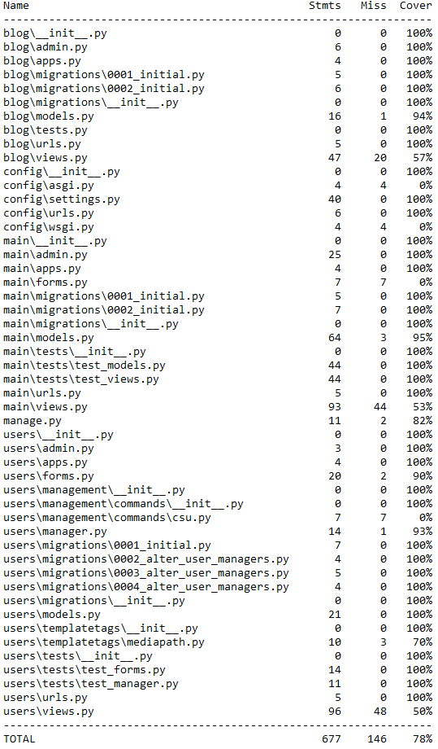

# :hospital: Сайт медицинской организации

## Содержание
- [Описание](#описание)
- [Начало работы](#установка-и-запуск)
- [Использование](#использование)
- [Контакты](#контакты)
- [Покрытие тестами](#покрытие-тестами)

## Описание

Мой проект — это создание интернет-платформы для поиска и записи на медицинские услуги. Пользователи смогут ознакомиться с медицинскими услугами, узнать информацию о специалистах и записаться на консультацию онлайн.


## Установка и запуск

### Склонируйте репозиторий:

```bash
git clone https://github.com/CHAPAPOPA/med_website.git
```

### Перейдите в папку с проектом

```bash
cd med_website
```

### Установите зависимости:

Сначала активируем poetry
```bash
poetry shell
```

Затем установим все зависимости из pyproject.toml
```bash
poetry install
```

Для определения необходимых переменных окружения воспользуйтесь шаблоном
```bash
.env.sample
```

Сделайте миграции
```bash
python manage.py makemigrations
python manage.py migrate
```

Создайте суперпользователя
```bash
python manage.py csu
```

Загрузите фикстуры
```bash
python manage.py loaddata fixtures
```

## Запуск приложения в Docker

Для сборки образа и запуска контейнера, выполните команду
```sh
docker-compose up -d --build
```

## Запуск программы

### Сервер сайта
Для запуска сервера сайта выполните команду:
```bash
python manage.py runserver
```


## Использование

### Главная страница

На главной странице сайта отображается список направлений диагностики (необходимо предварительно заполнить базу данных экземплярами Специализаций), причём каждая надпись представляет собой ссылку, при переходе по которой пользователь попадает на страницу с подробной информацией о данном направлении диагностики, а также со списком врачей, имеющих данную специализацию.
Кроме того, на главной странице есть ссылки на соцсети создателя проекта – все ссылки рабочие.

### Блог

На сайте можно публиковать интересные либо полезные материалы для посетителей сайта. Создавать новые посты можно как из админки, так и непосредственно на сайте, при условии авторизации под суперпользователем. Только модераторы могут создавать, редактировать и удалять посты. Обычные пользователи могут лишь просматривать посты, при этом счётчик просмотров поста увеличивается. Посты отсортированы по дате публикации: от новых к старым. При создании либо редактировании поста можно указать в качестве автора одного из врачей либо не указывать никого.

### Врачи

На данной странице выводится список всех врачей клиники (необходимо предварительно внести их в базу данных) с отображением имени и фамилии, фотографии врача, а также списка его специализаций.

### Запись на приём

Для работы данного функционала необходимо в админке создать экземпляры услуг, а также экземпляры записей на приём: какой врач, в какую дату и время и какую услугу готов оказать. При создании экземпляра записи на приём можно сразу указать конкретного пациента – в этом случае пациент будет автоматически записан на приём. Если оставить поле «Пациент» пустым, то такая запись появится в публичном доступе на сайте, и любой пациент сможет забронировать себе эту запись. Во время бронирования записи она закрепляется за конкретным пациентом и перестает быть видимой и доступной для всех других пациентов.
Пациент может просмотреть свои актуальные записи (на будущее время), а может просмотреть архив прошедших записей (в прошлом времени).
Если зайти на страницу записи на приём под профилем админа, то можно увидеть все существующие записи на приём, а также закрепленных за ними пациентов.
Админ видит все записи на приём, в будущем и в прошедшем времени, с пациентами и без.
Пациент видит только записи в будущем времени и только без закрепленных пациентов.
Админ может создавать записи только на будущее время.

### Аутентификация

Для регистрации на сайте необходимо указать свой e-mail, который должен быть уникален. На указанную при регистрации электронную почту будет выслано письмо с ссылкой для подтверждения регистрации. При переходе по ссылке регистрация завершается, и новый пользователь становится активным.
Только авторизованные пользователи могут видеть записи на приём и бронировать их.
У каждого пользователя есть свой личный кабинет, в котором пользователь может при желании отредактировать информацию о себе.


## Покрытие тестами



---

Этот README файл предоставляет основную информацию о проекте, его установке и использовании.

## Контакты

- [GitHub](https://github.com/CHAPAPOPA)
- [Telegram](https://t.me/CHAPAPOPA)
- [Email](mailto:yackow.muliawin2015@yandex.ru)
